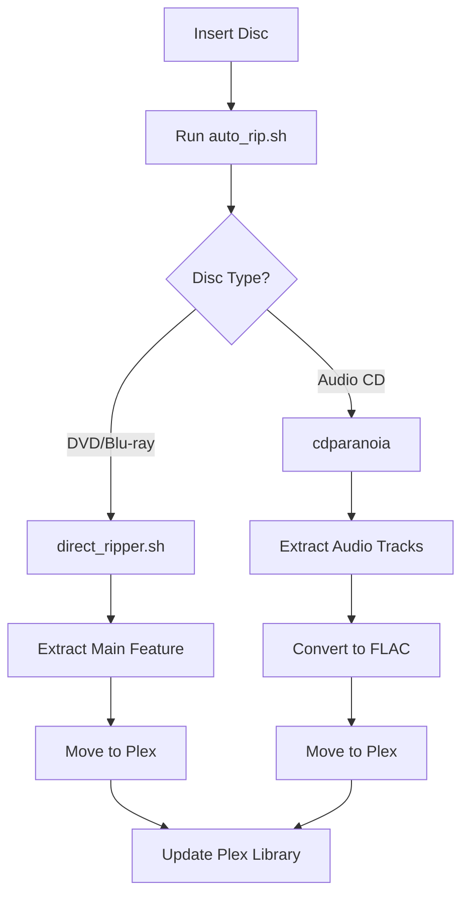

# 💿 DVD & Blu-ray Ripper for Plex


A comprehensive solution for automating DVD and Blu-ray disc ripping directly to your Plex media server. This collection of shell scripts handles everything from disc detection to library organization.

<p align="center">
  
</p>

## 🌟 Features

| Feature | Description |
|---------|-------------|
| 🔍 **Smart Detection** | Automatically detects DVD, Blu-ray or Audio CD media |
| 🎬 **Main Feature Focus** | Identifies and extracts the primary content |
| ⏱️ **Progress Tracking** | Real-time status with elapsed time display |
| 🔄 **Error Recovery** | Alternative ripping approaches for problematic discs |
| 🗂️ **Plex Integration** | Automatically organizes and refreshes your Plex library |
| ⚙️ **Configurable** | Easy to customize for your specific setup |

## 📋 Scripts Overview

| Script | Purpose | Link |
|--------|---------|------|
| [`auto_rip.sh`](auto_rip.sh) | Main entry point script - detects disc type and routes to appropriate handler | [View Code](auto_rip.sh) |
| [`direct_ripper.sh`](direct_ripper.sh) | DVD/Blu-ray specific ripper with advanced features | [View Code](direct_ripper.sh) |
| [`auto_rip_video.sh`](auto_rip_video.sh) | Video-specific ripping with additional options | [View Code](auto_rip_video.sh) |

## 🔧 Requirements

- Linux system with DVD/Blu-ray drive
- [MakeMKV](https://www.makemkv.com/) (for disc ripping)
- cdparanoia (for audio CD ripping)
- Plex Media Server (installed and configured)
- Basic command-line knowledge

## 📥 Installation

1. **Clone this repository:**
   ```bash
   git clone https://github.com/yourusername/dvd-bluray-ripper.git
   cd dvd-bluray-ripper
   ```

2. **Make scripts executable:**
   ```bash
   chmod +x *.sh
   ```

3. **Configure your setup:**
   Edit the configuration variables at the top of each script to match your system paths and Plex token.

## 🚀 Usage

### Automatic Disc Detection and Ripping

```bash
./auto_rip.sh
```

<details>
<summary>Click to see what this does</summary>

1. Detects the disc type (DVD, Blu-ray, or Audio CD)
2. Launches the appropriate ripper based on media type
3. Extracts content (main feature for video, all tracks for audio)
4. Moves files to your configured Plex library folders
5. Refreshes your Plex library to include new content
6. Ejects the disc when complete

</details>

### Direct DVD/Blu-ray Ripping

```bash
./direct_ripper.sh
```

<details>
<summary>Click to see the workflow</summary>

1. Scans the disc and displays all available titles
2. Suggests the main feature based on duration
3. Allows you to select which title to rip
4. Lets you customize the output filename
5. Shows real-time progress with elapsed time
6. Moves the completed file to your Plex movie library
7. Updates Plex to recognize the new content

</details>

## ⚙️ Configuration

Edit these key variables in the scripts to match your system:

```bash
# Primary configuration variables
PLEX_DIR="/mnt/plexmedia/Movies"       # Where your movies are stored
TEMP_DIR="/mnt/plexmedia/rip_temp/video"  # Temporary ripping location
LOG_DIR="/mnt/plexmedia/rip_logs"      # Where logs are stored
PLEX_TOKEN="your_plex_token"           # Your Plex server token
```

<details>
<summary>How to find your Plex token</summary>

1. Sign in to Plex web app
2. Open a media item
3. Click the ⋮ (three dots) menu → "Get Info"
4. In the URL of the XML file, look for "X-Plex-Token="
5. Copy the token value

</details>

## 🔄 Process Flow



## 🛠️ Troubleshooting

| Problem | Solution |
|---------|----------|
| **Disc not detected** | Ensure drive is recognized with `lsblk \| grep rom` |
| **Ripping fails** | Script will automatically offer alternative approach with `--noscan` |
| **Timeout errors** | For very large discs, the script now uses a 2-hour timeout |
| **File permissions** | Make sure you have write access to configured directories |
| **Files not showing in Plex** | Verify your Plex libraries are properly configured and refreshed |

## 🔍 Debugging Commands

```bash
# See if drive is recognized
lsblk | grep rom

# Check disc in drive
sudo blkid /dev/sr0

# Test MakeMKV detection
timeout 30s makemkvcon info disc:0

# Verify file was created
ls -lh /mnt/plexmedia/Movies/

# Manual Plex refresh
curl -X POST "http://localhost:32400/library/sections/1/refresh" \
     -H "X-Plex-Token: your_plex_token"
```

## 📜 License

This project is licensed under the MIT License with Attribution - see the [LICENSE](LICENSE) file for details. 

In short:
- ✅ Commercial use allowed with attribution
- ✅ Modification and distribution permitted
- ✅ Private use unrestricted
- ❗ Attribution required for redistribution

## 👏 Acknowledgments

- [MakeMKV](https://www.makemkv.com/) for their powerful disc ripping software
- [Plex](https://www.plex.tv/) for their excellent media server
- The Linux community for tools like cdparanoia

## 👤 Author

Original scripts by [traxx](https://github.com/yourusername)

Enhanced with [Claude AI](https://www.anthropic.com/claude)

---

<p align="center">
  <a href="https://github.com/yourusername/dvd-bluray-ripper/issues">Report Bug</a> •
  <a href="https://github.com/yourusername/dvd-bluray-ripper/issues">Request Feature</a>
</p>