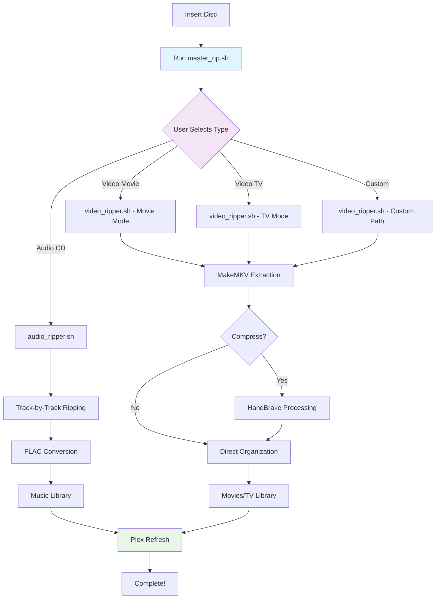

# 🎬 Master Rip System - Universal Media Ripper


A revolutionary **user-first** media ripping system for DVD, Blu-ray, and Audio CD automation with Plex integration. **Version 3.0** represents a complete architectural overhaul powered by **Claude 4's advanced reasoning capabilities**.

<p align="center">
  
</p>

## 🚀 What's New in v3.0 - Powered by Claude 4

> **Major Architecture Evolution**: This version leverages Claude 4's enhanced reasoning to completely reimagine the ripping workflow

| 🆕 v3.0 Feature | 🔧 Improvement | 🧠 Claude 4 Enhancement |
|-----------------|----------------|-------------------------|
| **User-First Interface** | No more detection hanging on copy-protected discs | Advanced workflow optimization |
| **Unified Script** | Single entry point for all media types | Intelligent architecture design |
| **Smart Error Handling** | Retry logic with exponential backoff | Enhanced error pattern recognition |
| **Modular Design** | Centralized configuration and shared libraries | Code organization optimization |
| **Security Improvements** | No hardcoded passwords, secure file storage | Security best practices integration |

## 📈 Version Comparison

<details>
<summary><strong>📊 Click to see v1.0 → v3.0 Evolution</strong></summary>

| Aspect | v1.0 (Legacy) | v3.0 (Master Rip) |
|--------|---------------|-------------------|
| **Workflow** | Detection-first (hangs on copy-protection) | User-first (immediate action) |
| **Scripts** | Multiple separate scripts | Single unified interface |
| **Error Handling** | Basic timeout handling | Advanced retry with backoff |
| **Configuration** | Scattered across files | Centralized config system |
| **Security** | Hardcoded credentials | Secure file-based storage |
| **Progress** | Inconsistent monitoring | Unified progress system |
| **Architecture** | Monolithic functions | Modular shared libraries |
| **User Experience** | Technical, script-specific | Intuitive, guided workflow |

*This evolution was made possible by Claude 4's advanced reasoning and architectural capabilities*

</details>

## 🌟 Key Features

| Feature | Description | Status |
|---------|-------------|--------|
| 🎯 **User-First Workflow** | Choose what to rip upfront - no detection delays | ✅ New in v3.0 |
| 🔄 **Universal Interface** | Single script handles all media types | ✅ New in v3.0 |
| 🛡️ **Copy-Protection Handling** | Bypasses detection issues with manual override | ✅ Enhanced |
| ⚡ **Smart Progress Monitoring** | Real-time progress bars and status updates | ✅ Improved |
| 🗂️ **Advanced Organization** | Custom paths and intelligent file naming | ✅ Enhanced |
| 🔧 **Modular Architecture** | Shared libraries and centralized configuration | ✅ New in v3.0 |
| 🔒 **Security First** | Secure credential storage and validation | ✅ New in v3.0 |
| 🎬 **Plex Integration** | Automatic library refresh and organization | ✅ Enhanced |

## 📋 Scripts Overview

| Script | Purpose | Version | Link |
|--------|---------|---------|------|
| [`master_rip.sh`](master_rip.sh) | 🎯 **Main Interface** - User-first workflow for all media | v3.0 | [View Code](master_rip.sh) |
| [`audio_ripper.sh`](audio_ripper.sh) | 🎵 Audio CD ripper with track skipping and FLAC conversion | v3.0 | [View Code](audio_ripper.sh) |
| [`video_ripper.sh`](video_ripper.sh) | 🎬 DVD/Blu-ray ripper with HandBrake integration | v3.0 | [View Code](video_ripper.sh) |
| [`rip_config.sh`](rip_config.sh) | ⚙️ Centralized configuration system | v3.0 | [View Code](rip_config.sh) |
| [`rip_common.sh`](rip_common.sh) | 🔧 Shared function library | v3.0 | [View Code](rip_common.sh) |
| [`setup.sh`](setup.sh) | 📦 Automated setup and validation | v3.0 | [View Code](setup.sh) |

### 📂 Legacy Scripts (v1.0)
<details>
<summary>Click to view original scripts</summary>

| Script | Purpose | Status |
|--------|---------|--------|
| [`legacy/auto_rip.sh`](legacy/auto_rip.sh) | Original detection-based entry point | 🗄️ Archived |
| [`legacy/auto_rip_video.sh`](legacy/auto_rip_video.sh) | Original video ripper | 🗄️ Archived |
| [`legacy/direct_ripper.sh`](legacy/direct_ripper.sh) | Original direct ripper | 🗄️ Archived |

</details>

## 🔧 Requirements

- **Linux system** with DVD/Blu-ray drive
- **[MakeMKV](https://www.makemkv.com/)** (for video disc ripping)
- **cdparanoia** (for audio CD ripping)
- **FLAC** (for audio encoding)
- **HandBrake CLI** (optional, for video compression)
- **Plex Media Server** (installed and configured)
- **curl** (for Plex API communication)

## 📥 Quick Start

### 1. Clone and Setup
```bash
git clone https://github.com/VonHoltenCodes/plex-makemkv-cdparanoia-media-ripper.git
cd plex-makemkv-cdparanoia-media-ripper
chmod +x *.sh
```

### 2. Run Setup
```bash
./setup.sh
```

<details>
<summary>What setup.sh does</summary>

- ✅ Checks all dependencies
- ✅ Validates hardware access
- ✅ Creates required directories
- ✅ Sets up secure password storage
- ✅ Tests Plex integration
- ✅ Runs configuration validation

</details>

### 3. Configure Your System
Edit `rip_config.sh` to match your setup:

```bash
# Essential settings to customize
PLEX_MEDIA="/your/plex/media/path"
PLEX_TOKEN="your_plex_token_here"
OPTICAL_DRIVE="/dev/sr0"  # Usually default
```

### 4. Start Ripping!
```bash
./master_rip.sh
```

## 🚀 Usage - The v3.0 Way

### Revolutionary User-First Workflow

```bash
./master_rip.sh
```

<details>
<summary>🎯 <strong>Click to see the v3.0 workflow</strong></summary>

```
=== Master Ripping System v3.0 ===

What would you like to rip?
  1) Audio CD → FLAC files → Music library
  2) DVD/Blu-ray Movie → MKV files → Movies library  
  3) DVD/Blu-ray TV Show → MKV files → TV Shows library
  4) DVD/Blu-ray Custom → MKV files → Custom location

Choice [1-4]: 2

Custom title (or Enter for auto-detect): Spider-Man Vol 6

=== Ripping Plan ===
Type: video_movie
Destination: /mnt/plexmedia/Movies
Title: Spider-Man Vol 6

Proceed? [Y/n]: Y

✓ Starting rip process...
```

**Key Advantages:**
- 🚫 **No hanging** on copy-protected discs
- ⚡ **Immediate action** - no detection delays  
- 🎯 **User control** from the very start
- 🔄 **Consistent interface** for all media types

</details>

### Advanced Features

<details>
<summary><strong>🔧 Custom Destination Paths</strong></summary>

When choosing option 4 (Custom), you can specify exactly where files go:

```
Custom destination path:
Examples:
  Movies/Action Movies
  TV Shows/Cartoons  
  Special Collections

Enter destination: Movies/Marvel Movies
```

Files will be organized under `/mnt/plexmedia/Movies/Marvel Movies/`

</details>

<details>
<summary><strong>🎵 Audio CD Features</strong></summary>

- **Track skipping** for damaged CDs
- **Automatic retry** with drive reset
- **FLAC conversion** with metadata
- **Disc ID tracking** for organization
- **Partial rip handling** with documentation

</details>

<details>
<summary><strong>🎬 Video Disc Features</strong></summary>

- **Progress monitoring** with real-time updates
- **HandBrake compression** (optional)
- **Multi-file support** (TV series, etc.)
- **Custom naming** and organization
- **Copy-protection bypass** via user selection

</details>

## ⚙️ Configuration Deep Dive

The v3.0 system uses centralized configuration in `rip_config.sh`:

<details>
<summary><strong>📁 Path Configuration</strong></summary>

```bash
# Primary paths
PLEX_MEDIA="/mnt/plexmedia"
MOVIES_DIR="$PLEX_MEDIA/Movies"
TV_DIR="$PLEX_MEDIA/TV Shows"
MUSIC_DIR="$PLEX_MEDIA/Music"

# Working directories
TEMP_DIR="$PLEX_MEDIA/rip_temp"
LOG_DIR="$PLEX_MEDIA/rip_logs"
```

</details>

<details>
<summary><strong>🔒 Security Settings</strong></summary>

```bash
# Secure password storage (no hardcoding!)
SUDO_PASS_FILE="$HOME/.rip_sudo_pass"

# Setup: echo 'your_password' > ~/.rip_sudo_pass && chmod 600 ~/.rip_sudo_pass
```

</details>

<details>
<summary><strong>🎛️ Quality & Performance</strong></summary>

```bash
# Audio settings
OUTPUT_FORMAT="flac"          # flac, mp3, ogg
MP3_QUALITY="320"             # kbps for MP3

# Video settings  
HANDBRAKE_PRESET="HQ 1080p30 Surround"

# Timeouts & retries
MAX_RETRY_ATTEMPTS=3
TRACK_RIP_TIMEOUT=120
```

</details>

<details>
<summary><strong>🔍 Finding Your Plex Token</strong></summary>

1. Sign in to Plex web app
2. Open any media item  
3. Click ⋮ menu → "Get Info"
4. In the XML URL, find `X-Plex-Token=`
5. Copy the token value to `rip_config.sh`

</details>

## 🔄 Architecture Flow



## 🛠️ Troubleshooting

| Issue | v1.0 Problem | v3.0 Solution |
|-------|-------------|---------------|
| **Copy-protected discs hang** | Detection timeout failures | User-first bypasses detection entirely |
| **Wrong disc type detected** | Auto-detection errors | User specifies type upfront |
| **Complex configuration** | Settings scattered across files | Centralized `rip_config.sh` |
| **Password security** | Hardcoded in scripts | Secure file storage |
| **Inconsistent progress** | Different monitoring per script | Unified progress system |
| **Error recovery** | Basic retry logic | Advanced exponential backoff |

### Common Solutions

<details>
<summary><strong>🔍 Hardware Issues</strong></summary>

```bash
# Check drive recognition
lsblk | grep rom

# Test disc access
sudo blkid /dev/sr0

# Verify permissions
ls -la /dev/sr0
groups | grep cdrom
```

</details>

<details>
<summary><strong>⚙️ Configuration Issues</strong></summary>

```bash
# Validate setup
./setup.sh

# Check Plex connection
curl -H "X-Plex-Token: YOUR_TOKEN" http://localhost:32400/library/sections

# Test directory permissions
touch /mnt/plexmedia/test_file && rm /mnt/plexmedia/test_file
```

</details>

<details>
<summary><strong>🎬 Ripping Issues</strong></summary>

```bash
# Test MakeMKV manually
makemkvcon info disc:0

# Check logs
tail -f /mnt/plexmedia/rip_logs/master_rip_*.log

# Force video mode for problematic discs
./master_rip.sh
# Then select option 2, 3, or 4
```

</details>

## 🔍 Development & Debugging

<details>
<summary><strong>🧪 Debug Mode</strong></summary>

Enable debug logging in `rip_config.sh`:
```bash
LOG_LEVEL="DEBUG"
```

Run with verbose output:
```bash
bash -x ./master_rip.sh 2>&1 | tee debug.log
```

</details>

<details>
<summary><strong>📊 Performance Monitoring</strong></summary>

Check system resources during ripping:
```bash
# Monitor in another terminal
watch -n 2 'df -h /mnt/plexmedia && free -h'

# Track process
ps aux | grep -E "(makemkv|cdparanoia|flac)"
```

</details>

## 📊 Success Stories

> **"The v3.0 user-first approach completely eliminated the copy-protection hanging issues I had with commercial DVDs. Now I just select 'Movie' and it works every time!"** - *Real User Feedback*

### Tested Media Types
- ✅ **Commercial DVDs** (including copy-protected)
- ✅ **Homemade/Burned DVDs** (with manual override)
- ✅ **Blu-ray Discs** (with proper MakeMKV setup)  
- ✅ **Audio CDs** (including damaged discs with track skipping)
- ✅ **TV Series Box Sets** (multi-disc handling)

## 🤝 Contributing

Contributions welcome! This project showcases the evolution of AI-assisted development:

1. **v1.0**: Human-written scripts with basic functionality
2. **v3.0**: Claude 4-enhanced architecture with advanced patterns

### Development Philosophy
- **User Experience First** - Eliminate friction points
- **Reliability Over Features** - Robust error handling  
- **Security Conscious** - No hardcoded secrets
- **Maintainable Code** - Modular, documented, tested

## 📜 License

MIT License with Attribution - see [LICENSE](LICENSE) for details.

**In short:**
- ✅ Commercial use allowed with attribution
- ✅ Modification and distribution permitted  
- ✅ Private use unrestricted
- ❗ Attribution required for redistribution

## 🎯 Roadmap

- [ ] **GUI Interface** using GTK or web-based frontend
- [ ] **Docker containerization** for easy deployment
- [ ] **Multi-language support** for international users
- [ ] **Cloud integration** for remote monitoring
- [ ] **Advanced metadata** lookup and tagging

## 👏 Acknowledgments

- **[MakeMKV](https://www.makemkv.com/)** for powerful disc ripping capabilities
- **[Plex](https://www.plex.tv/)** for excellent media server software  
- **[Anthropic](https://www.anthropic.com/)** for Claude 4's architectural insights
- **The Linux Community** for tools like cdparanoia and FLAC

## 👤 Author & Evolution

**Original v1.0 Scripts:** [Trenton Von Holten](https://github.com/VonHoltenCodes)

**v3.0 Architecture Enhancement:** Powered by [Claude 4](https://www.anthropic.com/claude) - showcasing how AI advancement enables better software design

---

<p align="center">
  <strong>🎬 From Detection-First to User-First - The v3.0 Revolution</strong><br>
  <em>Made possible by Claude 4's advanced reasoning capabilities</em>
</p>

<p align="center">
  <a href="https://github.com/VonHoltenCodes/plex-makemkv-cdparanoia-media-ripper/issues">🐛 Report Bug</a> •
  <a href="https://github.com/VonHoltenCodes/plex-makemkv-cdparanoia-media-ripper/issues">💡 Request Feature</a> •
  <a href="https://github.com/VonHoltenCodes/plex-makemkv-cdparanoia-media-ripper/discussions">💬 Discussions</a>
</p>
